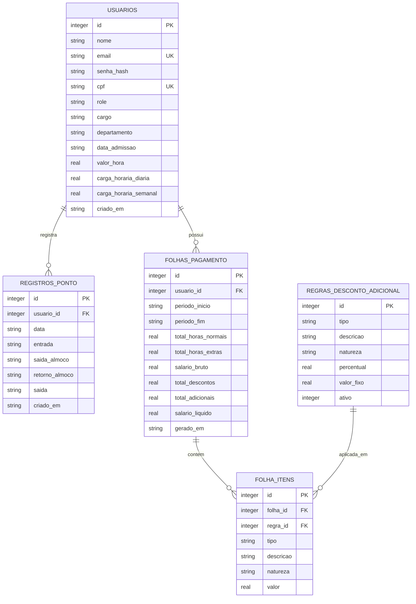

# Diagrama ER — API de Ponto Eletrônico

Este diagrama reflete o schema atual do banco (`usuarios.db`), incluindo as tabelas já
migradas para suportar os módulos de ponto e folha de pagamento.



> GitHub, GitLab e a maioria dos visualizadores de Markdown renderizam blocos ` ```mermaid `
> automaticamente. Se o seu visualizador não renderizar, cole o conteúdo em
> [mermaid.live](https://mermaid.live) para ver o diagrama.

## Descrição das tabelas

### `usuarios`

Tabela original do projeto, estendida para suportar os perfis de acesso e os dados
funcionais exigidos pelo módulo de folha de pagamento.

| Campo | Tipo | Observação |
|---|---|---|
| `id` | INTEGER PK | |
| `nome` | TEXT | |
| `email` | TEXT | único |
| `senha_hash` | TEXT | nunca exposto pela API |
| `cpf` | TEXT | único (índice separado — SQLite não aceita `UNIQUE` em `ALTER TABLE ADD COLUMN`) |
| `role` | TEXT | `ADMIN` ou `EMPLOYEE` |
| `cargo` | TEXT | |
| `departamento` | TEXT | |
| `data_admissao` | TEXT (`YYYY-MM-DD`) | |
| `valor_hora` | REAL | usado no cálculo de folha |
| `carga_horaria_diaria` | REAL | em horas |
| `carga_horaria_semanal` | REAL | em horas |
| `criado_em` | TEXT | preenchido automaticamente |

### `registros_ponto`

Uma linha por colaborador por dia. Criada na primeira marcação do dia; as marcações
seguintes fazem `UPDATE` na mesma linha (`UNIQUE(usuario_id, data)`).

### `regras_desconto_adicional`

Regras cadastradas pelo RH (impostos, faltas, atrasos, vale transporte, vale refeição).
Cada regra usa **ou** `percentual` **ou** `valor_fixo`, nunca os dois — essa restrição já
está garantida por `CHECK` no schema.

### `folhas_pagamento`

Um registro por colaborador por período de apuração, gerado quando o RH processa a folha.
Imutável após a criação.

### `folha_itens`

Snapshot dos descontos/adicionais aplicados em cada folha no momento em que ela foi gerada.
Existe para que, se uma regra em `regras_desconto_adicional` for editada ou desativada
depois, as folhas antigas continuem mostrando exatamente os valores que foram aplicados
naquela época.
